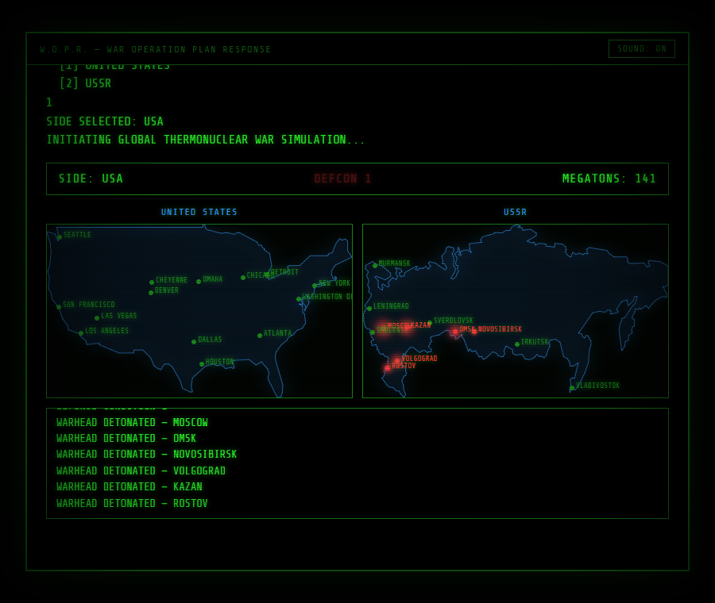
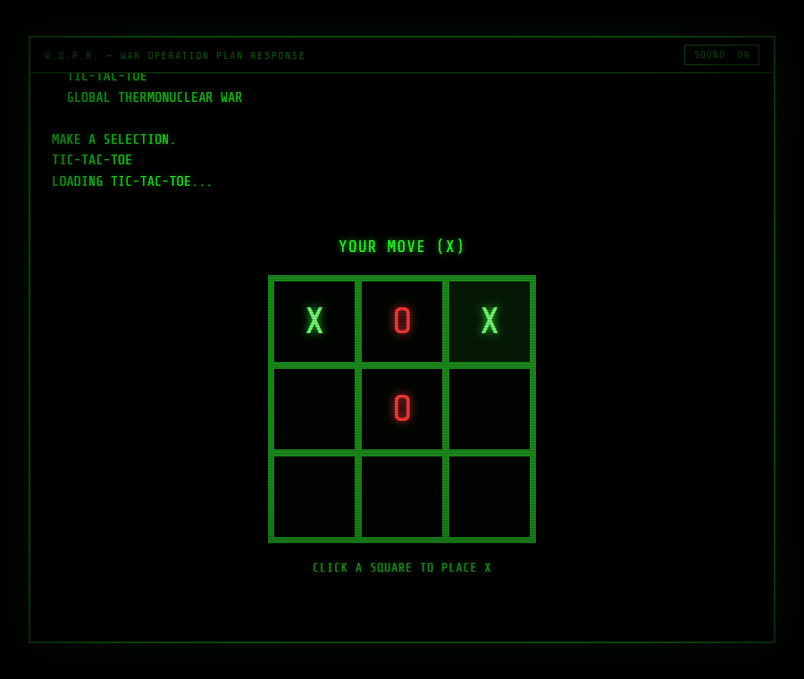

# W.O.P.R.

A browser recreation of the WOPR computer terminal from *WarGames* (1983) —
type at it like the real thing, work through its game menu, and either play
tic-tac-toe against an unbeatable AI or run the "Global Thermonuclear War"
simulation to watch it arrive at the same conclusion Joshua does in the film.



## What it does

Load the app and it boots like a 1983 modem terminal: a connection sequence,
then `GREETINGS PROFESSOR FALKEN.` Type anything to move past the greeting,
then `LIST GAMES` to see the full menu from the movie (Falken's Maze, Black
Jack, Chess, Theaterwide Biotoxic and Chemical Warfare, and so on). Most of
those are set dressing — WOPR politely declines to run them. Two are real:

- **TIC-TAC-TOE** — a playable grid against a minimax AI that plays
  perfectly, so it can only draw or win, never lose. After a draw you can
  ask WOPR to play itself, which rapid-fires several games back-to-back to
  show that every optimal game ends the same way.
- **GLOBAL THERMONUCLEAR WAR** — pick a side (United States or USSR) and
  watch an animated simulation: DEFCON counts down from 5 to 1, warheads
  detonate across two live target maps, and the megaton count climbs, all
  ending in `WINNER: NONE` and the film's closing line.



Both paths converge on the same beat as the movie: *"A strange game. The
only winning move is not to play."* — then it loops back to the menu.


## How to enter commands

Click the `>` prompt line at the bottom of the terminal, type, and press
**Enter** — or click the **ENTER ▸** button next to the input if Enter
doesn't register in your browser.

## Tech

- React + Vite
- No backend, no external APIs — everything (the script, the AI, the war
  sim) runs client-side
- WebAudio for the beeps/blips (toggle with the SOUND button)
- Plain CSS for the CRT look: scanlines, phosphor glow, vignette flicker

## Running it

```bash
npm install
npm run dev
```

Then open the printed local URL in your browser.
